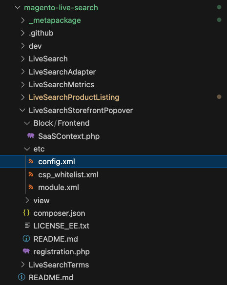
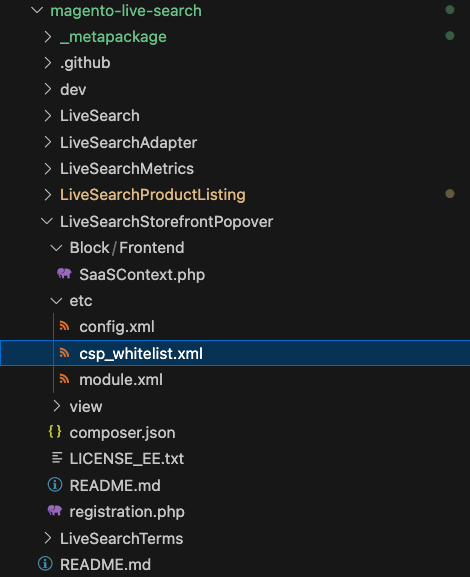

## Purpose

The purpose of this project is to provide a dev-ready starting point for developers to implement the search popover. A user of this library should have a Commerce store instance.

This repo is provided as a reference implementation only. While you’re expected to create your own customizations based on these assets, those customizations can’t be supported by Adobe.

## Available Scripts

In the project directory, you can run:

### `npm start`

Runs the app in the development mode.<br> Open [http://localhost:1234](http://localhost:1234) to view it in the browser.

### `npm run build`

Builds the app for production to the `build` folder.<br> It correctly bundles React in production mode and optimizes the build for the best performance.

The build is minified and the filenames include the hashes.<br> Your app is ready to be deployed!

See the section about [deployment](https://webpack.js.org/guides/production/) for
more information.

## Example Setup

import the script:

```
<script type="text/javascript" src="SearchAsYouType.js"></script>
```

### Setup the Store Details:

These will be passed with the extension if you have your storefront setup

#### Store Variables needed:
```
      ENVIRONMENT_ID 
      WEBSITE_CODE 
      STORE_CODE 
      STORE_VIEW_CODE 
      CUSTOMER_GROUP_CODE 
```

#### insert into store details config

```
const storeDetails = {
      environmentId: 'ENVIRONMENT_ID',
      websiteCode: 'WEBSITE_CODE',
      storeCode: 'STORE_CODE',
      storeViewCode: 'STORE_VIEW_CODE',
      config: {
        minQueryLength: 2,
        pageSize: 8,
        currencySymbol: '$',
        currencyRate: '1',
        displayOutOfStock: 'false',
      },
      context: {
        customerGroup: 'CUSTOMER_GROUP_CODE',
      },
    };
```

Append LiveSearchAutocomplete to the storefront window:

```
const root = document.querySelector('div.search-plp-root');

setTimeout(async () => {
      new window.LiveSearchAutocomplete({ storeDetails, root });
}, 1000);
```

You can see the example in [index.html](./public/index.html)

### NPM Library

This was build with our npm library: https://www.npmjs.com/package/@magento/storefront-search-as-you-type


## Styling 🎨

-   Ideally use Spectrum components for layouts if that's not possible, use [flex](https://css-tricks.com/snippets/css/a-guide-to-flexbox/) or [grid](https://css-tricks.com/snippets/css/complete-guide-grid/) for layout.

-   [Styled-Components](https://styled-components.com/) is included in this repo, ideal for minor component customizations.

-   Avoid deep customization on default Spectrum styling as this can potentially break the built-in accessibility features each component has. If you find yourself customizing the components too much, it might be worth to revisit your design.

## Hosting with CDN

Follow the below instructions on how to host with CDN and update your Commerce store to include your search-as-you-type page. 

1. In the root of this repository, install dependencies: `npm install`
1. Create a production build of the application: `npm run build`
1. After the previous step succeeds, it will output a `LiveSearchAutocomplete.js` file in the `dist/` directory. This is the production-ready search-as-you-type page.
1. Follow the instructions from your favorite frontend hosting with CDN (we use AWS S3 + Cloudfront, but there are many options to choose from) to upload the `LiveSearchAutocomplete.js` file.
1. The hosting platform with CDN will provide you a url where the `LiveSearchAutocomplete.js` file will be publicly hosted for your consumption.
1. Take the url where the `LiveSearchAutocomplete.js` file is hosted and validate in your browser that it is working correctly by loading the url in your browser and seeing the `LiveSearchAutocomplete.js` file returned to you.

NOTE: the below steps need to be updated to refer to the extension updates needed for this component:

1. Now the Live Search extension needs to be updated to include your new url. Find the `magento-live-search` extension code in your adobe commerce code base. Locate the directory `LiveSearchStorefrontPopover`.
1. We will be updating two files under `magento-live-search > LiveSearchStorefrontPopover`: `etc/config.xml` & `etc/csp_whitelist.xml`
1. Changes for `etc/config.xml`: change the live search autocomplete url in `<frontend_url>`to match the one you created with your hosting/CDN solution url above. See below.
1. 
1. Changes for `etc/csp_whitelist.xml`: find all references to the live search autocomplete (`livesearch-autocomplete.magento-ds.com`) and replace with your hosting/CDN solution url. See below.
1. 

NOTE: the above steps need to be updated to refer to the extension updated needed for this component. ^^

1. Those are all the required changes. Now redeploy your adobe commerce store code and see your new custom product listing page in your storefront.
